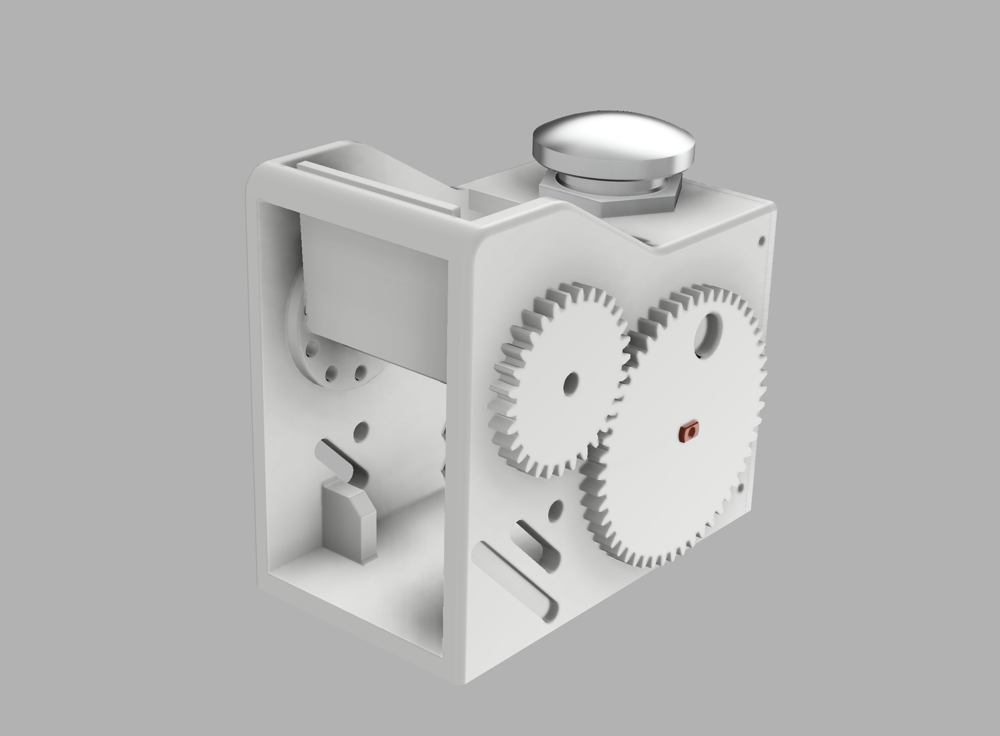

# Wiki-Flip Animator

## About this Project

这个本来是猫猫的一周年礼物呜呜呜呜😭😭😭😭

被我拖到了一周年纪念日后快一个月了才做完（）

是一个非常解压的翻牌动画器，可以在牌子上贴上自己喜欢的照片！~~猫猫于是说要贴我的表情包~~

<aside>
🙃 功能是：（正常情况不卡住的话）

- 短按：旋转一帧
- 双击：随机旋转
- 长按：回到原点后完整旋转一轮
</aside>

## Mechanics

<aside>
❗ 其实这个设计有很多问题

1. 翻牌器上梁太厚了，这个是没有经验导致的，这也导致了现在偶尔还是会卡住
2. 翻牌器安装顺序有问题，一开始设计的时候考虑用圆柱销，后来拿到手了以后才发现这样子根本没法拆下来重新装，而且并没有留足够的公差。
3. 后盖也没有留足够的公差
4. 步进电机的固定根本没有考虑到齿轮的问题，导致现在大齿轮凸出来一点
5. 内舱空间不够，最后成品里面线一团乱麻，后盖还盖不上
</aside>

## Hardware

使用了SLN2003驱动板+28BYJ步进电机，用ESP32C3 Super Mini控制。

如果线掉了猫猫可以自己接线阿巴阿巴🙃

## Software

项目中采用VSCode+PlatformIO平台进行开发。

在代码中主要用了CheapStepper库控制步进电机和Button2库控制按钮

在调试霍尔传感器的时候一直数据不稳，不知道为什么，所以后续的归零就靠ESP32的EEPROM做了。